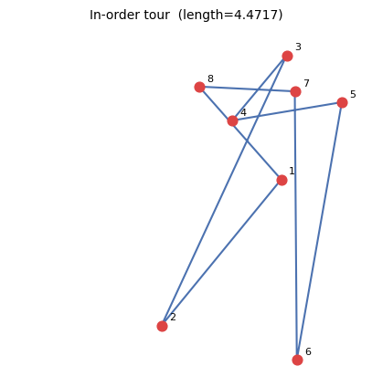
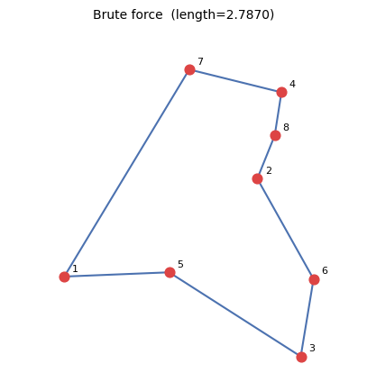
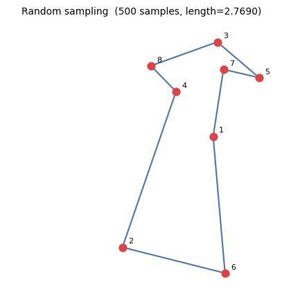
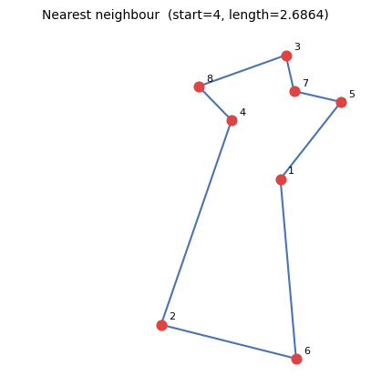
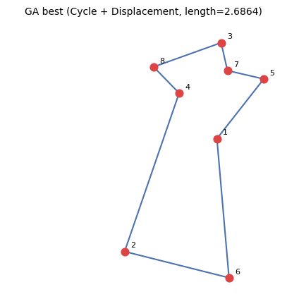

# TP1 — Travelling Salesman Problem

All results below use **8 cities** unless noted otherwise.

## 1. City generation & in-order tour

Cities were generated randomly. The in-order tour visits them in index order.

**Tour:** 1 → 2 → 3 → 4 → 5 → 6 → 7 → 8 → 1
**Length:** `4.4717`

## 2. Brute force (exhaustive search)

All 40320 possible tours were evaluated on a separate random city set.

**Best tour:** 3 → 6 → 2 → 8 → 4 → 7 → 1 → 5 → 3
**Length:** `2.7870`

## 3. Random sampling

500 random tours were sampled and the shortest one kept.

**Best tour:** 7 → 5 → 3 → 8 → 4 → 2 → 6 → 1 → 7
**Length:** `2.7690`

## 4. Nearest neighbour heuristic

The algorithm was run from every possible starting city.

| Start city | Tour | Length |
| --- | --- | --- |
| 1 | 1 → 4 → 8 → 3 → 7 → 5 → 6 → 2 → 1 | 2.7818 |
| 2 | 2 → 6 → 1 → 4 → 8 → 3 → 7 → 5 → 2 | 2.8365 |
| 3 | 3 → 7 → 5 → 1 → 4 → 8 → 2 → 6 → 3 | 3.1026 |
| 4 | 4 → 8 → 3 → 7 → 5 → 1 → 6 → 2 → 4 | 2.6864 |
| 5 | 5 → 7 → 3 → 4 → 8 → 1 → 6 → 2 → 5 | 2.9602 |
| 6 | 6 → 2 → 1 → 4 → 8 → 3 → 7 → 5 → 6 | 2.7818 |
| 7 | 7 → 3 → 5 → 1 → 4 → 8 → 2 → 6 → 7 | 3.0650 |
| 8 | 8 → 4 → 7 → 3 → 5 → 1 → 6 → 2 → 8 | 2.7669 |

**Best start:** city 4
**Best tour:** 4 → 8 → 3 → 7 → 5 → 1 → 6 → 2 → 4
**Length:** `2.6864`

## 5. Genetic algorithm

Parameters: population=100, generations=500, mutation rate=0.1

| Crossover + Mutation | Length | Tour |
| --- | --- | --- |
| Cycle + Displacement | 2.6864 | 2 → 6 → 1 → 5 → 7 → 3 → 8 → 4 → 2 |
| Cycle + Exchange | 2.7414 | 4 → 8 → 2 → 6 → 1 → 5 → 7 → 3 → 4 |
| PMX + Displacement | 2.6864 | 6 → 1 → 5 → 7 → 3 → 8 → 4 → 2 → 6 |
| PMX + Exchange | 2.6864 | 3 → 7 → 5 → 1 → 6 → 2 → 4 → 8 → 3 |
| Order + Displacement | 2.6864 | 3 → 7 → 5 → 1 → 6 → 2 → 4 → 8 → 3 |
| Order + Exchange | 2.6864 | 2 → 6 → 1 → 5 → 7 → 3 → 8 → 4 → 2 |

**Best combination:** Cycle + Displacement
**Best tour:** 2 → 6 → 1 → 5 → 7 → 3 → 8 → 4 → 2
**Length:** `2.6864`

## Summary

Comparison on the same 8-city set (brute force used its own random set).

| Method | Length | Notes |
| --- | --- | --- |
| In-order tour | 4.4717 | trivial baseline |
| Brute force | 2.7870 | different city set, guaranteed optimal |
| Random sampling | 2.7690 | 500 samples |
| Nearest neighbour | 2.6864 | best of 8 starts |
| Genetic algorithm | 2.6864 | best of 6 operator combos |

